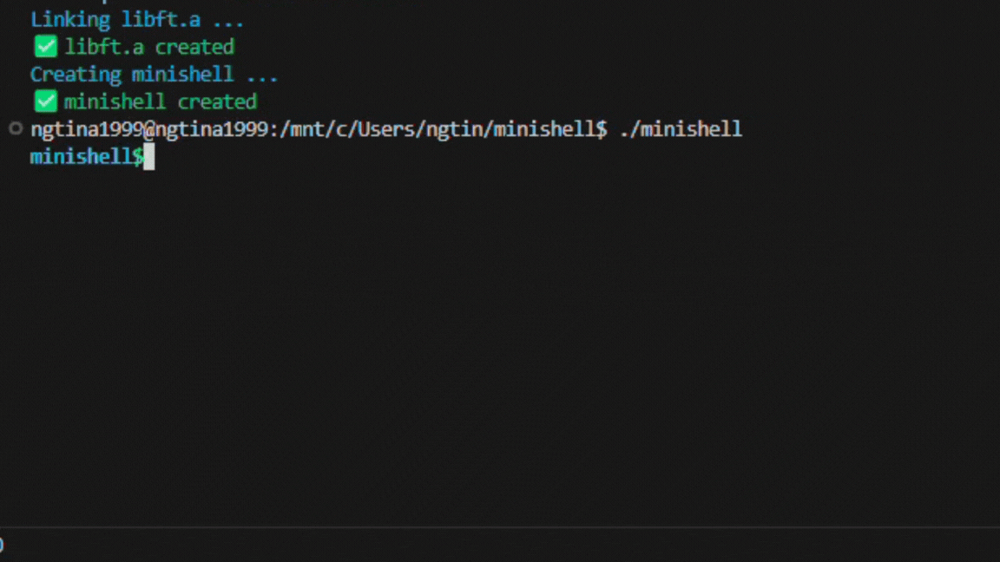

# minishell

A C-based Unix shell built from scratch - aka the magic behind your terminal.



<div align="center">
✨ This project was a collaboration with <a href="https://github.com/leanor13"><b>Yulia</b></a>. From late-night debugging sessions to complex C coding: we learned to turn frustration into progress and transforming our effort into a shell we’re genuinely proud of. ✨
</div>

## 🛠️ Usage
1️⃣ **Clone the repository**

```bash
git clone https://github.com/yourusername/webserv.git minishell
cd minishell
```

2️⃣ Build the shell

```bash
make
```

3️⃣ Run the shell

```bash
./minishell
```

3️⃣ Example commands for *minishell*

```bash
echo "As beautiful as a shell"
ls -l | grep minishell
exit
```

```bash
echo "Hello $USER"
cat << EOF
This is a heredoc
EOF
```

## 🌟 Features
- ✅ Command parsing and execution
- ✅ Pipes (`|`) support
- ✅ Input/output redirection (`>`, `<`, `>>`, `<<`)
- ✅ Built-in commands: `cd`, `echo`, `pwd`, `exit`, `env`, `export`, `unset`
- ✅ Environment variable handling (`VAR`, `$?`)
- ✅ Logical operators: `&&`, `||`
- ✅ Custom signal handling (`Ctrl+C`, `Ctrl+D`, `Ctrl+/`)
- ✅ Command history navigation

## 🧪 Example Tests
- Simple commands: /bin/ls, /bin/pwd, /bin/echo hello
- With arguments: /bin/ls -l, echo hello world
- Echo variations: echo -n no newline, echo "$USER", echo '$USER'
- Exit variations: exit, exit 42
- Check return values: echo $? after success or failure
- Signals test: Run cat → Ctrl+C, Ctrl+D, Ctrl+\
- Redirection tests: echo hello > file.txt, cat < file.txt, echo world >> file.txt
- Pipes tests: ls -l | grep minishell, cat file | grep hello | wc -l
- Environment path tests: Unset and reset $PATH to check behavior
- Bonus (if present): ls && echo ok, false || echo failover

## 🧮 Logic
```text
User Input
↓
[ parsing/ ]
→ lexer → parser → handle quotes, files, redirections
↓
[ executor/ ]
→ builds command list → manages pipes & heredoc → runs built-in or external
↓
[ built_ins/ ]
→ handles built-in commands (if matched)
↓
[ main_flow/ ]
→ manages shell loop, signal handling, environment init/cleanup
```

## 🛕 Structure
```text
minishell-main/
├── Makefile
├── includes/
│   ├── executor.h          --> executor modules
│   ├── lexer.h             --> lexer & parsing modules
│   ├── minishell.h         --> general project definitions
│   └── libft/
│       ├── Makefile        --> libft Makefile
│       └── *.c             --> custom library functions (libft)
├── srcs/
│   ├── built_ins/
│   │   ├── ft_cd.c        --> cd command
│   │   ├── ft_echo.c      --> echo command
│   │   ├── ft_env.c       --> env command
│   │   ├── ft_exit.c      --> exit command
│   │   ├── ft_export.c    --> export command
│   │   ├── ft_pwd.c       --> pwd command
│   │   └── ft_unset.c     --> unset command
│   ├── executor/
│   │   ├── executor_main.c  --> main executor loop
│   │   ├── pipex.c         --> pipe handling
│   │   ├── here_doc.c      --> heredoc handling
│   │   ├── open_fds.c      --> file descriptor setup
│   │   └── utils_*.c       --> free, close helpers, checkers
│   ├── main_flow/
│   │   ├── main_minishell.c --> main shell loop
│   │   ├── init.c          --> initialize structures, env
│   │   ├── signals.c       --> signal management
│   │   └── main_util*.c    --> main utilities, cleanup
│   └── parsing/
│       ├── lexer.c            --> tokenizes input
│       ├── lexer_handle_quote.c --> handles quotes
│       ├── parser.c           --> parses token stream
│       ├── parser_handle_files.c --> parses redirection
│       └── parser_ifutils*.c  --> conditional parsing helpers
```

## 📋 Memory checks

All features were tested under Valgrind:
- `valgrind --leak-check=full ./minishell`
- No leaks except those allowed from `readline()`

## 🤝 Credits
I couldn’t have asked for a better partner for my first big team project. Working with [**Yulia**](https://github.com/leanor13) on Minishell was both impactful and memorable.

## 💼 Connect
If you have any questions or suggestions, feel free to connect:
🔗 [LinkedIn: Valentina Nguyen](https://www.linkedin.com/in/valentina-nguyen-tina/) 🙋‍♀️

## 📜 License
This project is licensed under the MIT License. See LICENSE for details.

## 🖥️ System Compatibility
This project was developed and tested on Linux (Ubuntu).
